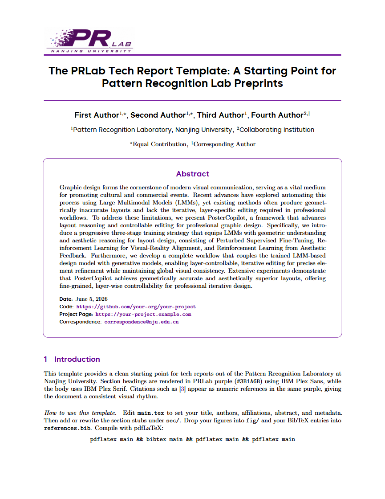
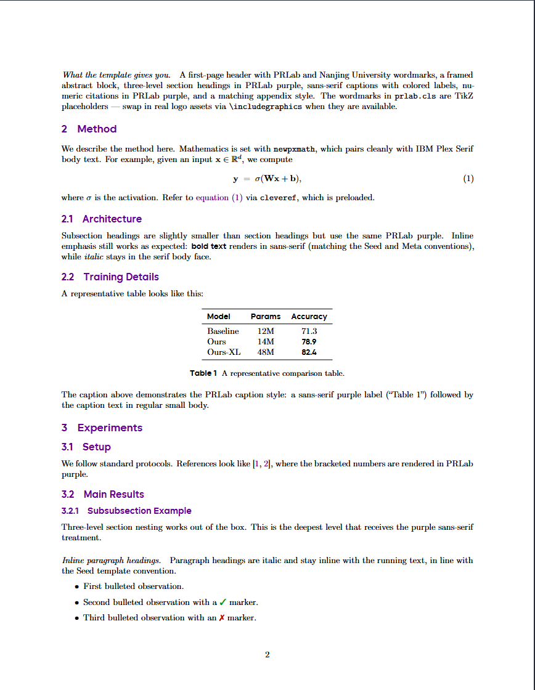

# PRLab Tech Report LaTeX Template

Official LaTeX template for tech reports and arXiv preprints out of the
**Pattern Recognition Laboratory, Nanjing University (PRLab @ NJU)**.

## Preview

<p align="center">
  
  
</p>

## Quick start (Overleaf)

1. Zip the entire `template_prlab/` folder.
2. Go to [Overleaf](https://www.overleaf.com/) → *New Project* → *Upload Project* → select the zip.
3. Set the compiler to **pdfLaTeX** (Menu → Compiler). It should already default to this.
4. Hit *Recompile*.

## Quick start (local)

Requires a TeX distribution with the IBM Plex font packages
(`plex-serif`, `plex-sans`, `plex-mono`). TeX Live 2024+ and MiKTeX
both ship with these.

```bash
pdflatex main
bibtex main
pdflatex main
pdflatex main
```

## File layout

```
template_prlab/
├── prlab.cls           # class file (all styling lives here)
├── main.tex            # entry point — edit title, authors, abstract
├── references.bib      # bibliography
├── sec/                # per-section .tex files
│   ├── intro.tex
│   ├── method.tex
│   ├── experiments.tex
│   ├── conclusion.tex
│   └── appendix.tex
├── fig/                # put figures here
└── README.md
```

## What's customizable in `main.tex`

| Command | Purpose |
|---|---|
| `\title{...}`            | Paper title |
| `\author[mark]{Name}`    | Add an author with a superscript mark (`*`, `\dagger`, etc.) |
| `\affiliation[mark]{...}`| Add an affiliation, optionally tied to a mark |
| `\contribution[mark]{...}` | Footnote-style note for a mark (e.g. "Equal contribution") |
| `\abstract{...}`         | Abstract body (rendered inside a purple-bordered box) |
| `\date{...}`             | Renders as a `Date:` row at the bottom of the abstract box |
| `\correspondence{...}`   | Renders as a `Correspondence:` row |
| `\metadata[Label]{value}`| Generic metadata row, e.g. `\metadata[Code]{\url{...}}` |

## Replacing the placeholder logos

`prlab.cls` defines `\prlablogo` and `\njulogo` as TikZ wordmark
placeholders (a purple-outlined "PRLab" / "Nanjing University" badge).
When you have real logo assets, drop them into `fig/` and redefine:

```latex
\renewcommand{\prlablogo}{\includegraphics[height=7mm]{fig/prlab_logo.pdf}}
\renewcommand{\njulogo}{\includegraphics[height=7mm]{fig/nju_logo.pdf}}
```

inside the preamble of `main.tex`, or edit the definitions directly in
`prlab.cls`.

## Design

See `../DESIGN.md` for the full visual specification (color palette,
typography, layout, citation style, and the rationale behind each choice).

## Acknowledgements

We gratefully thank **ByteDance** for releasing the **ByteSans** typeface,
which provides the sans-serif font used throughout this template — section
headings, affiliations, captions, and metadata. The clean, modern look of
the template owes a great deal to this beautiful font. All credit for the
typeface belongs to ByteDance and the original ByteSans authors.
